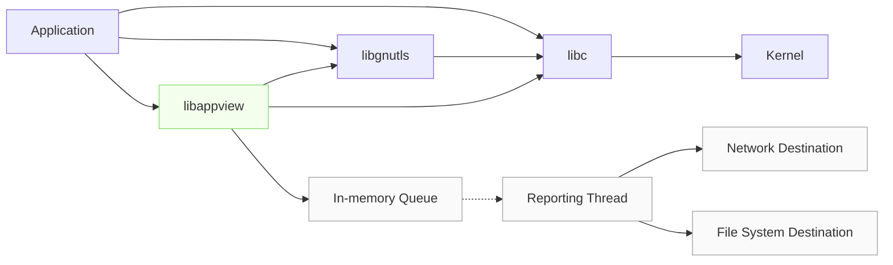

[](https://github.com/appview-team/appview/actions/workflows/build-and-test.yml)

# AppView

AppView is an open source, runtime-agnostic instrumentation utility for any Linux command or application. It helps users to explore, understand, and gain visibility with **no code modification**.

AppView provides the fine-grained observability of a proxy/service mesh, without the latency of a sidecar. It emits APM-like metric and event data, in open formats, to existing log and metric tools.

It’s like [strace](https://github.com/strace/strace) meets [tcpdump](https://www.tcpdump.org/) – but with consumable output for events like file access, DNS, and network activity, and StatsD-style metrics for applications. AppView can also look inside encrypted payloads, offering WAF-like visibility without proxying traffic.

<br />
<br />



## 💎 Features

- Generate metrics on process and application performance.
- Generate events, reporting on network, file, and http/s activity.
- Capture (decrypted) payload data without the need for keys.
- Generate a stack trace, and a core dump when an application crashes.
- Generate network flow information.
- Create a report on unique file and network activity.
- Install AppView in a Kubernetes cluster.

## 🛟 Support

AppView runs on most Linux distributions and is able to instrument **most applications**. You might be surprised to learn that AppView is even able to instrument static applications, and applications running in other containers. 

However, AppView **cannot**:

- Instrument Go executables built with Go 1.10 or earlier.
- Instrument static stripped Go executables built with Go 1.12 or earlier.
- Instrument Java executables that use Open JVM 6 or earlier, or Oracle JVM 6 or earlier.
- Obtain a core dump either (a) for a Go executable, or (b) in a musl libc environment.

We have an extensive set of integration tests, validating support for common applications including `postgres`, `sshd`, `kafka`, `node`, `python`, `nginx` on both ARM and x86 architectures, even in musl-based distributions like alpine.

## 🚀 Try It Out

Before you begin, ensure that your environment meets the AppView [requirements](https://appview.dev/docs/requirements).

**With the Download**
```
LATEST=$(curl -Ls https://cdn.cribl.io/dl/appview/latest)
curl -Lo appview https://cdn.cribl.io/dl/appview/$LATEST/linux/$(uname -m)/appview
curl -Ls https://cdn.cribl.io/dl/appview/$LATEST/linux/$(uname -m)/appview.md5 | md5sum -c 
chmod +x appview
appview <some app>
appview metrics
sudo appview attach <already running process>
appview events -f
appview detach --all
```

**With Docker**
```
docker run --rm -it -v/:/hostfs:ro --privileged cribl/appview
appview <some app> # AppView an app in the container
appview metrics
appview events
appview attach --rootdir /hostfs <process running on host> # AppView an app in the host
appview events -f
appview detach --all --rootdir /hostfs
```

## ℹ️  Resources

On the [AppView Website](https://appview.dev/) you can:

- Learn about all of the CLI commands [in more depth](https://appview.dev/docs/cli-using).
- Get an [overview](https://appview.dev/docs/how-works/) of AppView beyond the CLI.
- Discover what people are [doing](https://appview.dev/docs/what-do-with-appview) with AppView.
- Review advanced [examples](https://appview.dev/docs/examples-use-cases).
- View the [Changelog](https://appview.dev/docs/changelog) and [Known Issues](https://appview.dev/docs/known-issues).
- See what happens when you [connect AppView to Cribl Stream or Cribl Edge](https://appview.dev/docs/cribl-integration).

_The content on that site is built from the [website/](website/) directory in this project._

## 🔧 Build From Source

AppView is not built or distributed like most traditional Linux software.

- Insofar as possible, we want AppView binaries to be  **Build Once, Run Anywhere**. To approach this goal, we build with a version of glibc that is (1) recent enough that the resulting binary contains references to versions of functions in the glibc library *that are still supported in the latest glibc*, yet (2) old enough that the binaries can run on a wide range of Linux platforms without having to rebuild locally.
.
- We don't build OS installation packages like DEBs or RPMs. This way, when you want to investigate a running system or build a custom container image, you can simply drop AppView in and use it.

Build from source:

```text
git clone https://github.com/appview-team/appview.git
cd appview
./install_build_tools.sh # Install dependencies (ubuntu)
make all test # Build and test
```

If you aren't on Ubuntu, or would prefer not to install the dependencies, ensure that [Docker], [BuildX], and `make` are installed, then build in a container with:

```text
make build CMD="make all"
```

Either way, the resulting binaries will be in `lib/linux/$(uname -m)/libappview.so` and `bin/linux/$(uname -m)/appview`.

We support building `x86_64` (amd64) or `aarch64` (arm64/v8) binaries by adding `ARCH=x86_64` or `ARCH=aarch64` to the `make build` command. See the [BUILD](docs/BUILD.md) doc for details.

## ✏️  Contributing

If you're interested in contributing to the project, you can:

- View and add to GitHub [discussions](https://github.com/appview-team/appview/discussions) discussions about future work.
- View and add GitHub [issues](https://github.com/appview-team/appview/issues) that need to be resolved.
- See our developer guides in the [docs/](./docs/) directory in this repository.

## 📄 License

AppView is licensed under the Apache License, Version 2.0. 

[Docker]: https://docs.docker.com/engine/install/
[BuildX]: https://docs.docker.com/buildx/working-with-buildx/
