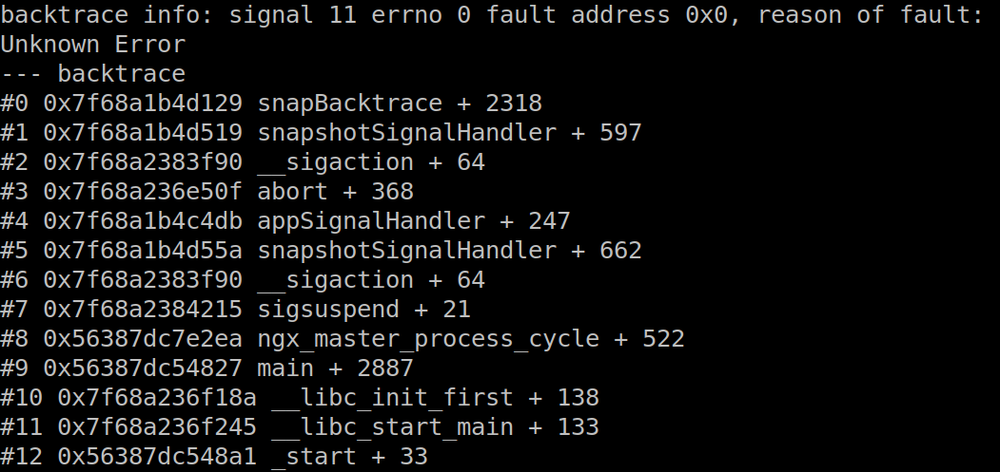
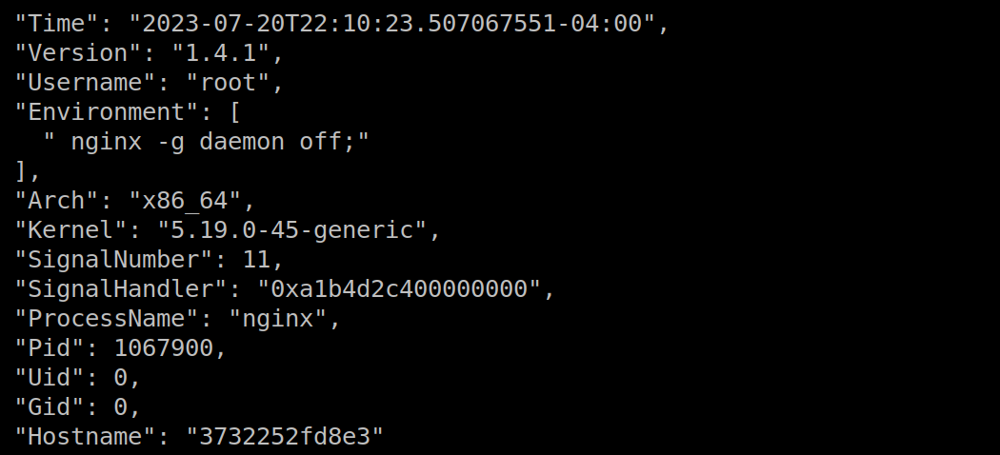

## Analyzing Application Crashes

When an application crashes, you can use AppView together with [eBPF](https://ebpf.io/what-is-ebpf/) to generate useful files and send those files to a network destination, before the environment is torn down.

In the walkthrough that follows, we'll run Nginx in a Docker container, force Nginx to crash, and send crash data – backtrace, core dump, and snapshot files – through Cribl.Cloud to Amazon S3.

If you prefer, you can easily adapt the procedure to analyze a crash of any process (not just Nginx); run on the host rather than a container; or, route the crash data to any network destination (not just Cribl.Cloud). You can even skip the network destination entirely and just view the crash files on disk.

### Prerequisites

You will need:

- An Amazon S3 account.
- A Linux host with Docker installed.
- A Cribl.Cloud instance – you can sign up for a free account at [https://cribl.cloud](https://cribl.cloud).

### Setting Up Your Cribl.Cloud Instance

In Cribl.Cloud, start by creating an Amazon S3 Destination:

1. Click **Manage Stream**.
2. Under **Worker Groups**, click `default`.
3. Click **Data** > **Destinations** and choose the Amazon S3 Destination.
4. Click **Add Destination** and configure the Destination with your S3 credentials and preferences. 
5. Click **Save**.

Next, configure the built-in TCP Source:

1. Click **Data** > **Sources** and choose the TCP Source.
2. Click the built-in `in_tcp` Source, enable it, and configure it with address `0.0.0.0` and port `10060`.
3. Click **Connected Destinations** and choose **QuickConnect**. Select your S3 Destination. 
4. Click **Save**.
5. Click **Commit and Deploy**.

You now have a Cribl.Cloud Worker listening for TCP data, and configured to send it on to S3.

### Setting Up AppView and eBPF

The `appview-ebpf` and AppView projects are separate and independent, and they operate under different licenses – for that reason, each has its own repo.

Download the AppView binary:

```
cd ~/Downloads  
curl -Lo appview https://github.com/appview-team/appview/releases/download/v1.0.0/appview-x86_64
curl -Ls https://github.com/appview-team/appview/releases/download/v1.0.0/appview-x86_64.md5 | md5sum -c
mv appview-x86_64 appview
chmod +x appview
```

Download and build the `appview-ebpf` binary:

```
git clone git@github.com:appview-team/appview-ebpf.git
cd appview-ebpf
make all
```

Deploy the eBPF module to listen for crashing applications:

```
sudo ~/Downloads/appview-ebpf/bin/appview-ebpf
```
Leave this shell running and open another terminal or tab.

Deploy the AppView daemon, to receive messages from eBPF and send crash files to a network destination:

```
sudo ~/Downloads/appview daemon --filedest tcp://<path-to-cribl-cloud-tcp>:10060
```

Once you start the daemon, the `appview-ebpf` binary will exit in the other terminal. That's normal.

At this point, preparation is complete:
* The eBPF kernel module should be loaded, listening for application crash signals. 
* The AppView Daemon should be running, waiting for the eBPF module to tell it that an application has crashed. 
* Once eBPF notifies AppView of a crash, AppView will look for crash files and send them on to the configured network destination.

### Making an Application Crash

Start a daemonized Nginx container:

```
docker run --rm -d nginx
```

Attach AppView to the containerized Nginx process, and enable backtrace and core dump on crash:

```
sudo ~/Downloads/appview attach --backtrace --coredump nginx
```

This command shows the Nginx process with its child processes, in a list. Note the PID of the parent Nginx process.

(Alternatively, you could have used the `appview run` [command](cli-reference#run) or the `appview rules` [command](cli-reference#rules) to tell AppView to load itself into an application when it starts.)

Force a crash of Nginx by sending the process a `BUS` error signal:

```
sudo kill -s SIGBUS <PID_of_nginx>
```
AppView will respond to any of the usual signals of a crashing process: `SIGBUS`, `SIGINT`, `SIGSEGV`, or `SIGFPE`.

Now look in your S3 bucket – you should see four files: `info`, `backtrace`, `snapshot`, and `cfg`. The same files, plus the core dump, should also be in `/tmp/appview/<PID_of_nginx>/`.

### Investigating the Crash

Here are a few hints about the meaningful insights that the crash files provide.

The backtrace file contains the application stack trace at the time of the crash:



The snapshot file contains properties of the process:



The core dump (not shown here) contains a binary snapshot of the application at the time of the crash, for inspection with a debugger like gdb. By default, the daemon does not send this over the network since it's not usually useful outside of its origin environment. The [man page](https://man7.org/linux/man-pages/man5/core.5.html) on core dumps can help you explore this data.

If this topic is of interest to you, and/or if you'd like some help getting the procedure to work, please get in touch – there are a [variety](https://appview.dev/docs/community/) of ways to do that.
