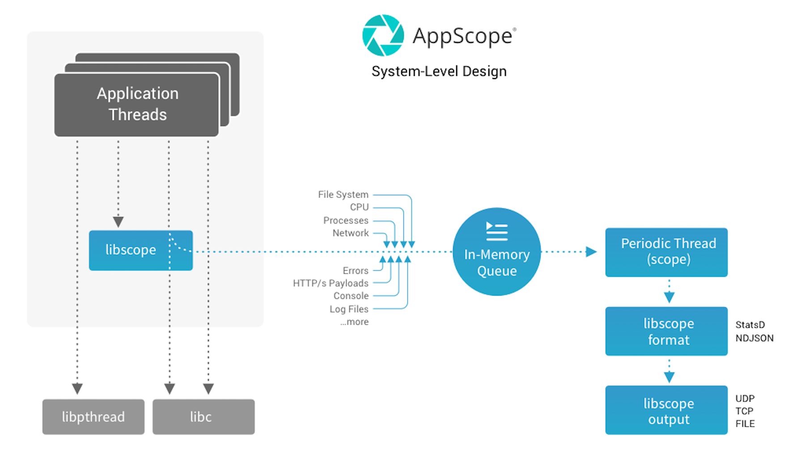

## How AppView Works

AppView extracts information by interposing functions. When an application calls a function, it actually calls a function of the same name in the AppView library (`libappview`), which extracts details from the function. Then the original function call proceeds. This interposition of function calls requires no change to an application: it works with unmodified binaries, and its CPU and memory overhead are minimal.

Child processes are created with the AppView library present, if the library was present in the parent. In this manner, a single executable is able to start, daemonize, and create any number of children, all of which include interposed functions.

If you're curious about the thought process that led to the creation of AppView, see this [blog](https://cribl.io/blog/the-appview-origin-story/) by the AppView team.

### Performance Overhead

AppView collects data with, at most, around 2% CPU overhead, and **minimal** latency penalty. In most cases, the overhead is markedly less than 2%, which is significantly more efficient than legacy and current monitoring systems.

## System-level Design

The AppView library (`libappview`) is the core component that resides in application processes, extracting data as an application executes. You have fine-grained control of the library's behavior, using environment variables or a [configuration file](/docs/config-file).

Whenever you work with AppView, you are always using the `libappview` library. You can control the library directly using environment variables and/or the AppView config file. Or, you can use the AppView CLI, which communicates with the library.
