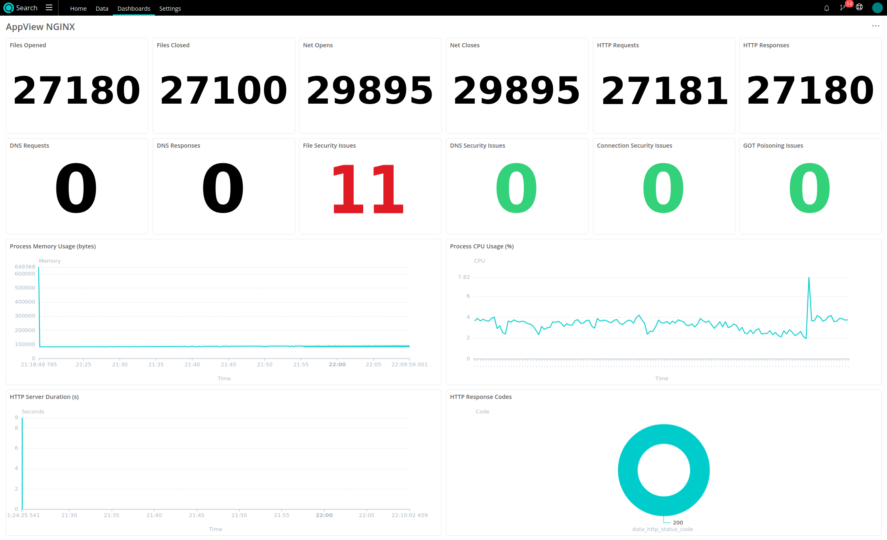

<span id="observability-dashboard"></span>

# Observability Dashboard

Today we will be building an observability dashboard to allow you to remotely monitor the behavior of an NGINX web server. The resulting dashboard will look something like this:



In order to achieve this result we will use:

- AppView
- Cribl Edge
- Cribl Search

...all of which do not require a paid license.

<span id="overview"></span>

## Overview

In this example we will monitor a node that runs the popular NGINX web server, by loading AppView into the NGINX application.
AppView will send metrics and events to a local instance of Cribl Edge. That Edge node will connect to a fleet in the Cloud, allowing us to use Cribl Search to display a dashboard and perform queries on the data.

#### Why AppView?

AppView is the only application that can instrument applications without any code modification, and the only application that will automatically decrypt data to get info like HTTP headers. It is also uniquely detecting Security Issues like those defined by Mitre, in real-time.

#### Why Cribl?

Cribl Edge is a lightweight agent that can be centrally managed by a leader in groups of thousands of nodes. Using Edge allows us to remotely configure the connection to AppView and make the data available in Cribl Search. Note, that we are not sending the data to any destination, instead it is spooled to disk on the node and the amazing Cribl Search is able to pull in the data to resolve queries and light up a dashboard.

<span id="deployment"></span>

## Deployment

#### AppView

Download AppView from the GitHub [Releases](https://github.com/appview-team/appview/releases) page and make it executable with:
```
chmod +x appview
```

#### Cribl Edge

1. Make a free account on [cribl.cloud](https://cribl.cloud) and sign in.

2. Click `Manage Edge`, click `default_fleet`, click `Add Edge Node -> Linux` and note the authtoken and leader hostname in the command. Close the dialogue box but keep the page open.

3. Download and run Cribl Edge:
```
curl -Lso - $(curl https://cdn.cribl.io/dl/latest-x64) | tar zxv
sudo mv cribl /opt/cribl-edge
cd /opt/cribl-edge/bin/
./cribl mode-managed-edge -H <your-leader-hostname> -p 4200 -u <your-authtoken-here> -S true
# Replace the params between <> above using your cloud account info.
./cribl start
```

4. Go back to the cribl.cloud webpage and after a minute or so you should see 1 Edge Node.

5. We can now remotely configure that node. Click `More -> Sources`, click `AppScope`. (AppScope and AppView are compatible at this point).

6. Click `in_appscope` and set the following:
- General Settings
  - Unix domain socket: Yes
  - Unix socket path: /opt/cribl-edge/state/appscope.sock
  - Authentication method: manual
  - Auth token: \<leave empty\>
  - Unix socket permissions: 777
- Processing Settings -> Disk Spooling
  - Enable disk spooling: Yes
  - Bucket time span: 1h

7. Click `Save` to close the modal then click `Enabled -> yes`.

8. Click `Commit and Deploy`, enter an arbitrary commit message and hit `Commit and Deploy`.

9. After a minute, the remote Edge node will receive and implement the new configuration and start listening to AppView on the Unix Socket.

#### NGINX

Restart NGINX with AppView loaded: _(Another method would be to attach AppView to an already-running NGINX)_
```
sudo nginx -s stop
sudo ./appview run -c unix:///opt/cribl-edge/state/appscope.sock -- nginx # Starting nginx requires root privileges
```
At this point we should verify a couple of things:
```
sudo ./appview ps # Confirm that nginx is started and AppView is loaded
sudo ./appview inspect # Should show interfaces: cribl: connected: true
```
At this point, you might want to start making some requests to the NGINX server. We can use Apache's AB utility to simulate activity by installing it and running a script, like:
```
sudo apt install apache2-utils
vi abclient.sh
```
```
#!/bin/bash

while true; do
  # Run Apache Benchmark with 100 requests (-n) and 10 concurrent requests (-c)
  ab -n 10 -c 10 http://127.0.0.1:80/
  sleep 1
done
```
```
chmod +x abclient.sh
./abclient.sh
```

#### Cribl Search

The benefit of using Edge and Search together is that the Datasets and Dataset providers for AppView and Edge are already present in Search, so we don't need to do any additional configuration to locate that data. 

1. Back in cribl.cloud, transition to Search by clicking the Edge logo and clicking `Search`.

2. [Download the JSON for the dashboard](./assets/dashboard-nginx.json)

3. Click `Dashboards`, click `Add Dashboard`, give it a name and click `Save`. Click `... -> Edit as JSON` then import the dashboard.

At this point, your dashboard in Cribl Search should start lighting up (you might have to manually refresh the page) and you can start feeling the power of deep IT and Security observability.

<span id="where-to-go"></span>

## Where to go from here

- Drill into the search panels to see the data behind the numbers by clicking Search on each panel.
- Modify the dashboard and the panel queries to suit your needs.
- Run AppView in multiple applications, either manually or with a set of application rules.
- Deploy Edge to multiple nodes.

