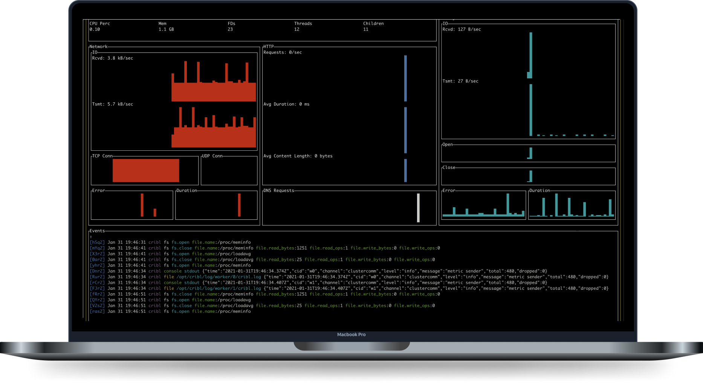

## What Is AppView?

AppView is a tool that unlocks 100% application observability with near-zero overhead, including for applications and processes whose data is otherwise hard to obtain.

AppView is an open source, runtime-agnostic instrumentation utility for any Linux command or application. It helps users explore, understand, and gain visibility into any process running in any Linux host or container with **no code modification**. 

AppView provides the fine-grained observability of a proxy/service mesh, without the latency of a sidecar. It emits APM-like metric and event data, in open formats, to existing log and metric tools.

It’s like [strace](https://strace.io/) meets [tcpdump](https://www.tcpdump.org/) – but with consumable output for events like file access, DNS, and network activity, and StatsD-style metrics for applications. AppView can also look inside encrypted payloads, offering [WAF](https://en.wikipedia.org/wiki/Web_application_firewall)-like visibility without proxying traffic. 
 
 

## Instrument, Observe, and Secure with AppView

AppView is runtime-agnostic, has no dependencies, and requires no code modification or recompilation. You can use AppView to:

- Instrument both static and dynamic executables.
- Attach to processes *while they are running* or start when the process does.
- Capture application metrics: **File, Network, Memory, CPU**.
- Capture application events: console content, stdin/out, logs, errors.
- Capture any and all payloads: DNS, HTTP, HTTPS.
- Capture logs emitted to files or the console by an application – with zero configuration.
- Generate a stack trace, and a core dump when an application crashes.
- Create a report on unique file and network activity.
- Secure file and network access in an application.
- Normalize and forward metrics and events, in real time, to remote systems.
- Summarize metrics and detect protocols.
- Install AppView in a Kubernetes cluster.
- Run on Alpine Linux, another Linux distribution based on musl libc, or on a glibc-based distro.
- Communicate safely and securely with TLS over TCP connections.

AppView works with static or dynamic binaries, and can instrument anything running in Linux. The CLI makes it easy to inspect any application without needing a man-in-the-middle proxy. Once you've gained familiarity, you can use the AppView library independently of the CLI, with even more fine-grained configuration options.

AppView collects and forwards StatsD-style metrics about running applications. With HTTP-level visibility, any web server or application can be instantly observable. AppView's output allows you to use general-purpose tools instead of specialized APM tools and agents.

## Use Cases

You could do any of the following with AppView:

- Send HTTP events from Slack to a specified Splunk server.
- Send metrics from nginx to a specified Datadog server.
- Send metrics from a Go static application to a specified Datadog server.
- For any of the above examples, substitute your analytics tool of choice. Optimize the data flow by mediating it through [Cribl Stream](https://cribl.io/product/).
- Run `appview service sshd` in the AppView CLI, so that the next time the `sshd` service starts, it will be viewed.
- Run Firefox from the AppView CLI, and view results on a terminal-based dashboard.
- Run Google Chrome from the AppView CLI, and view results on a terminal-based dashboard. And be surprised.
- Monitor multiple Apache instances in a server farm, running the data [through Cribl Edge to Cribl Stream](/docs/cribl-integration#scaling-viewed-processes).
- Generate a footprint of an application in a long running test that can be used to compare future behavior, for example, to guard against dependency chain attacks.

