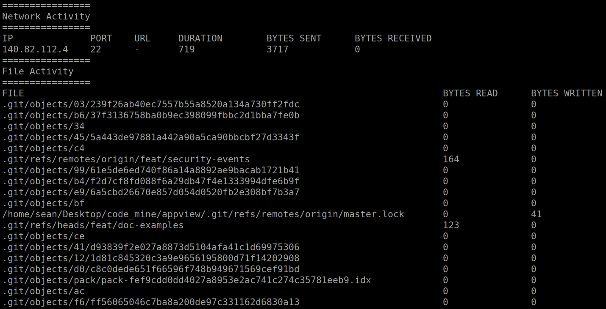

<span id="application-privacy-report"></span>

# Application Privacy Report

You can use AppView to generate a report on an application or process. AppView will instrument a process and any children created after the time AppView was loaded into it.

This might be useful for:
- Individuals concerned about their Privacy
- Security experts intending to understand an application's behavior, or create a footprint of an application.

<span id="generating-a-report"></span>

## Generating a Report

You can load AppView into a new process like:

```
appview git fetch  # Run `git fetch` with AppView loaded
appview report     # Generate a report of network and file system activity
```

__Pro Tip__: Create reports on previous AppView sessions using the `--id` flag to identify a session.

Report output:


